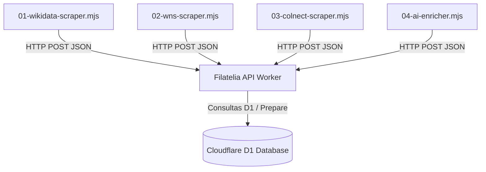

# Guía Maestra de Extracción y Scraping - Filatelia

Este documento detalla el diseño, la arquitectura y los procedimientos para la recopilación masiva de datos filatélicos globales e integración con la base de datos **Cloudflare D1** a través de la API Serverless del proyecto.

---

## 📐 1. Arquitectura del Pipeline de Datos

El pipeline se ejecuta localmente (en tu máquina o VPS) para evadir bloqueos de IPs y limites de recursos, conectándose directamente con la base de datos de producción **Cloudflare D1** usando el endpoint `/import-stamp` del API Worker, protegido con un token de administrador (ver sección 3).



---

## 🛠️ 2. Módulos y Scrapers Implementados

Los archivos de scraping están ubicados en la carpeta `scrapers/` de tu proyecto:

### 1️⃣ `01-wikidata-scraper.mjs` (Fase 1 - Sellos Históricos y Clásicos)
* **Fuente**: Wikidata SPARQL Endpoint (`https://query.wikidata.org/sparql`).
* **Características**: Consultas 100% gratuitas, sin riesgo de bloqueo de IP. Obtiene imágenes de Wikimedia Commons, catalogación básica, fechas históricas y creadores.
* **QID Utilizado**: `Q37930` (postage stamp).

### 2️⃣ `02-wns-scraper.mjs` (Fase 2 - Catálogo Moderno Oficial)
* **Fuente**: WNS (WADP Numbering System) de la Unión Postal Universal (`https://www.wnsstamps.post`).
* **Características**: ~122,000 sellos modernos de más de 130 países. Utiliza peticiones POST con payloads de país y año. Posee delay aleatorio de 4 segundos para evitar rate limit.

### 3️⃣ `03-colnect-scraper.mjs` (Fase 3 - El Santo Grial)
* **Fuente**: Colnect (`https://colnect.com/es/stamps`).
* **Características**: ~1,200,000 sellos con números de catálogo oficiales (Scott, Michel, Yvert) y estimación de precios.
* **Evasión Antibot**: Usa `puppeteer-extra` con el plugin de `stealth`, simula interacciones humanas (movimientos de mouse, scroll lento) y rota User-Agents reales.

### 4️⃣ `04-ai-enricher.mjs` (Fase 4 - Enriquecimiento IA con OpenRouter)
* **Proveedor**: OpenRouter con el modelo gratuito de alto rendimiento `google/gemma-3-27b-it:free`.
* **Características**: Toma los sellos nuevos sin descripción o tags e invoca la API para autogenerar:
  * Descripciones enriquecidas en español e inglés.
  * Clasificación automática de la temática principal (flora, fauna, historia, etc.).
  * Tags para el buscador semántico.
  * Puntuación de rareza filatélica (`rarityScore` del 1 al 10) y flags de variantes raras o de error.

---

## 🔌 3. ¿Hacia Dónde está Conectado?

* **Endpoint Destino**: `https://filatelia-api.rodrigopianto2005.workers.dev/import-stamp`.
* **Seguridad de Upsert**: El endpoint `/import-stamp` resuelve automáticamente:
  1. Si un sello con el mismo código `wnsNumber` ya existe, actualiza los campos vacíos de forma inteligente sin sobrescribir datos verificados.
  2. Crea de forma dinámica los catálogos (`Catalog`) y grupos de sellos (`StampGroup`) si no existían previamente en la base de datos SQLite.
  3. Relaciona los sellos con su respectivo país de origen y temática.

### 🔐 Autenticación requerida (`ADMIN_API_TOKEN`)

`POST /import-stamp` está protegido por `requireAdmin`: toda petición debe
enviar la cabecera `X-Admin-Token` con el mismo valor que el secreto
`ADMIN_API_TOKEN` del Worker, o el Worker responde `403 Forbidden` sin
tocar D1. Antes de este cambio el endpoint no requería credenciales — cualquiera
en internet podía insertar o sobrescribir filas de `Stamp` en producción; eso
ya no es el caso.

Los tres scrapers (`01-wikidata-scraper.mjs`, `02-wns-scraper.mjs`,
`03-colnect-scraper.mjs`) leen `ADMIN_API_TOKEN` de la variable de entorno del
mismo nombre y la envían automáticamente en cada llamada a `/import-stamp`.
Si la variable no está definida, el scraper falla inmediatamente al arrancar
(antes de iniciar cualquier crawl) con un mensaje explicando cómo definirla,
en vez de correr horas y descubrir al final que cada escritura fue rechazada
con 403.

Para correr un scraper local o en un VPS:

```bash
export ADMIN_API_TOKEN="<mismo valor que el secreto ADMIN_API_TOKEN del Worker>"
node scrapers/01-wikidata-scraper.mjs --limit 500
```

El valor debe coincidir con el secreto `ADMIN_API_TOKEN` provisionado en el
Worker (`wrangler secret put ADMIN_API_TOKEN`, ver
`openspec/changes/unified-session/tasks.md`, tarea 3.4). No lo definas en
`wrangler.toml` ni lo comitees al repositorio.

### 🔑 Otras credenciales (OpenRouter, DataImpulse, Colnect)

Ningún scraper trae credenciales embebidas: todas se leen de variables de
entorno y, si falta alguna, el script se detiene de inmediato con un mensaje
explicando cuál falta — antes de arrancar el navegador o hacer la primera
petición, para no gastar horas de crawl (y ancho de banda de proxy) contra un
script que va a fallar en el primer request real.

Copiá `scrapers/env.example` a `scrapers/.env`, completá los valores reales
y exportalos en tu shell (o usá `source scrapers/.env` / `dotenv-cli`) antes
de correr cualquier scraper:

```bash
cp scrapers/env.example scrapers/.env
# editá scrapers/.env con los valores reales
set -a && source scrapers/.env && set +a
node scrapers/04-ai-enricher.mjs
python3 scrapers/colnect_global_scraper_v3.py
```

| Variable | Usado por | Qué es |
| --- | --- | --- |
| `ADMIN_API_TOKEN` | scrapers Node y Python que escriben en `/import-stamp` | Token de admin del Worker (ver sección anterior) |
| `OPENROUTER_API_KEY` | `04-ai-enricher.mjs` | API key de OpenRouter (https://openrouter.ai/keys) |
| `DATAIMPULSE_HOST` | scrapers Python que usan proxy residencial | Host:puerto del gateway DataImpulse (dashboard.dataimpulse.com) |
| `DATAIMPULSE_USER` | ídem | Usuario del proxy DataImpulse |
| `DATAIMPULSE_PASS` | ídem | Password del proxy DataImpulse |
| `COLNECT_USERNAME` | scrapers Python que hacen login en Colnect (`debug_login.py`, `refresh_cookies.py`, `vm_solve_anubis.py`) | Email/usuario de la cuenta de Colnect |
| `COLNECT_PASSWORD` | ídem | Password de la cuenta de Colnect |

Los helpers que implementan este chequeo "fail-fast" son
`scrapers/lib/admin-token.mjs` (`requireAdminToken()`) para Node y
`scrapers/scraper_env.py` (`require_env()` / `require_admin_token()`) para
Python.

**Nota sobre `scrapers/colnect_colab_scraper.py`, `scrapers/colnect_global_scraper.py`
y `scrapers/repair_colnect_images.py`**: el proxy DataImpulse ahí es opcional
(código heredado de Google Colab). Si no definís `DATAIMPULSE_HOST` el script
sigue corriendo sin proxy premium, tal como antes.

---

## 🚀 4. Guía de Ejecución

Usa el orquestador maestro `scrapers/run-pipeline.mjs` para gestionar todas las fases desde la terminal:

### 📊 Ver Estado del Pipeline
Muestra la cantidad de sellos por fuente, países dominantes y cobertura de datos (imágenes, temas, descripciones):
```bash
node scrapers/run-pipeline.mjs status
```

### 🧪 Ejecutar una Prueba Rápida
Extrae y guarda 50 sellos iniciales de Wikidata para comprobar que la conexión funciona de punta a punta:
```bash
node scrapers/run-pipeline.mjs test
```

### 📚 Fase 1: Wikidata (Históricos)
* Descarga masiva para todo el mundo:
  ```bash
  node scrapers/run-pipeline.mjs phase1
  ```
* Descarga filtrada para un país específico (ejemplo: Perú):
  ```bash
  node scrapers/run-pipeline.mjs phase1 --country=PE
  ```

### 📮 Fase 2: WNS (Oficial Moderno)
* Extraer catálogo moderno por país y año específico:
  ```bash
  node scrapers/run-pipeline.mjs phase2 --country=PE --year=2024
  ```

### 🔍 Fase 3: Colnect (Requiere Puppeteer)
* Descarga de sellos detallados de Colnect evadiendo la seguridad de Cloudflare:
  ```bash
  node scrapers/run-pipeline.mjs phase3 --country=PE
  ```

### 🤖 Fase 4: Enriquecimiento Inteligente
* Enriquecer los siguientes 100 sellos en D1 usando IA gratuita de OpenRouter:
  ```bash
  node scrapers/run-pipeline.mjs enrich --limit=100
  ```

---

## 💡 Recomendaciones para Producción
1. **Lotes Diarios**: Se recomienda correr el scraper de Colnect/WNS en lotes nocturnos (ej. 10,000 sellos al día) para no generar alertas de seguridad o bloqueos de IPs residenciales.
2. **Checkpoints**: Los scrapers guardan su progreso en formato JSON dentro de `scrapers/checkpoints/`. Si la conexión se corta, simplemente vuelve a ejecutar el comando y reanudará exactamente desde donde se quedó.
